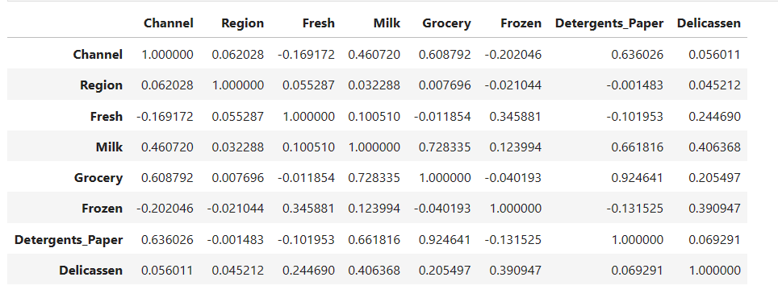
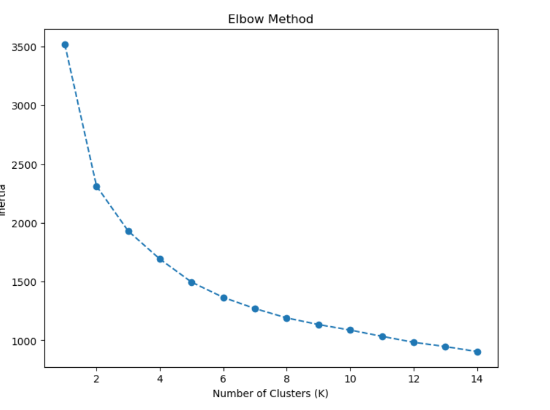
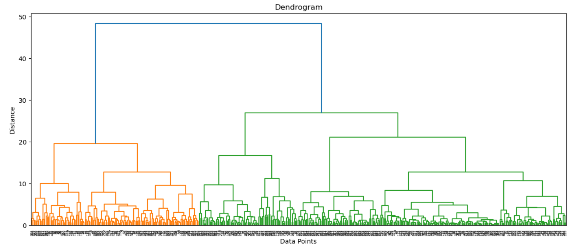
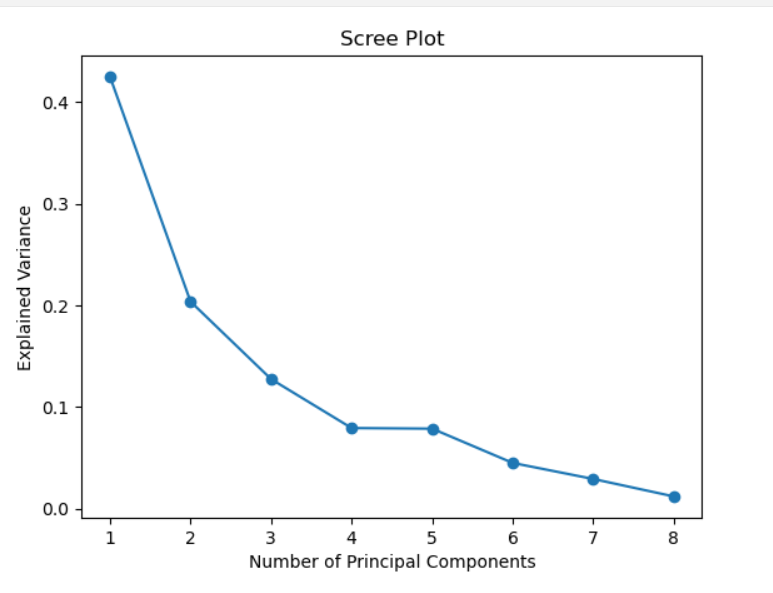

# machine_learning_project-unsupervised-learning


## Project Description:
-In this project, we will apply unsupervised learning techniques to a real-world data set and use data visualization tools to communicate the insights gained from the analysis.

-The data set for this project is the "Wholesale Data" dataset containing information about various products sold by a grocery store.
The project will involve the following tasks:

-	Exploratory data analysis and pre-processing: We will import and clean the data sets, analyze and visualize the relationships between the different variables, handle missing values and outliers, and perform feature engineering as needed.

-	Unsupervised learning: We will use the Wholesale Data dataset to perform k-means clustering, hierarchical clustering, and principal component analysis (PCA) to identify patterns and group similar data points together. We will determine the optimal number of clusters and communicate the insights gained through data visualization.

## Process

### Exploratory Data Analysis and Pre-processing

- The data has no null or duplicate values

- Checking the distribution of data with histograms of all the features,
the data is not normally distributed and data is skewed.

- 

- As seen feature data points takes a big jump after 3rd quartile(75%) and it could be potential outliers

- We have created a Boxplot to identify the outliers in features.

- To handle outliers we have created a function that removes the outliers more than upper limit and less than lower limit
```
def handle_outliers(dataframe, column):
    Q1 = dataframe[column].quantile(0.25)
    Q3 = dataframe[column].quantile(0.75)
    IQR = Q3 - Q1
    lower_limit = Q1 - 1.5*IQR
    upper_limit = Q3 + 1.5*IQR
    dataframe[column] = dataframe[column].apply(lambda x: upper_limit if x > upper_limit else lower_limit if x < lower_limit else x)
```
- Outliers have been removed with the function and now the data is normally distributed

- Now we will scale(using Standard Scaler) the data as most of the clustering algorithms are sensitive to different scale in the data 

### K-Means Clustering

- our objective is to group similar features together in a cluster

- for K-Means method we will first try to find the optimal value of k (number of clusters) that are best for model, we will take a range of k and run the loop and then compare plot the points on the graph and get the best k value through elbow method(value after the change in intertia is contant)



- As seen we can do 4 clusters for our data, now run fit the model again and divide the data into 4 clusters

- Then we can see how the data is clustered with statistical description or visualization

### Hierarchical Clustering 

- Hierarchical clustering is a unsupervised machine learning algorithm that is used to identify patterns and group similar data points together in a hierarchy. The algorithm works by iteratively merging or splitting clusters based on a similarity measure until a dendrogram is formed.

- we will find the best number of clusters throgh the denogram created



- From the dendogram we will determine the cut off distance, it defines the threshold at which you cut the dendrogram to form a specific number of clusters where we look out for the longest vertical in the figure before joining.

- after taking cut off distance we calculated the cluster and it gave us 4 clusters.

- we can create a graph or check the descriptive statistics and the numbers are higher than the K-Means for features belonging to a particular cluster (i.e features are not divided along the different clusters equally)

### PCA (Principal Component Analysis)

- PCA is used for dimension reduction on the features, we will start with the model and let it decide the features and then plot the Scree Plot to check how many dimensions explains most of the variance

- Then we are creating a scree plot to see after which feature the variance change is minimal.

- As seen fromt the graph after 4th point the variance is not changing significantly



### Conclusion

- Data is not normally distributed.

- Clustering Algorithms are sensitive to outliers

- Hierchical Clustering is more effective then KMeans

- 4 principle components components will explain most of the variance(found through PCA)